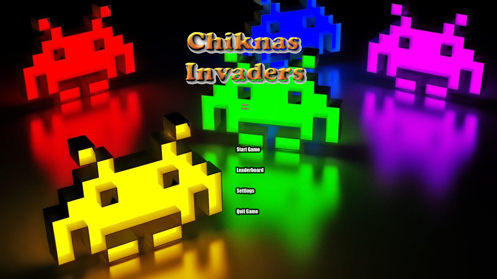

<h1>Nikos Invaders: The humble beginnings</h1>

RnD project to get the feeling of JavaFX and Javackager to deploy a self contained application to windows, mac and linux machines.



<h3>Windows installer:</h3>
You can install the game by downloading the exe installer from [here](executable/bundles/NikosInvaders-v1.2.exe)  
Required windows version is Windows 10.

<h3>Controls:</h3>
<b> Use F12 to toggle fullscreen mode </b>  
LEFT and RIGHT arrows to move your character  
SPACE BAR to fire at the enemies  
CTRL to fire a cannon ball  
ESC to go back to the main menu at any time  

<h3>DEMPOYMENT:<h3>

<h4>Requirements</h4>

To create an installer for windows we need Inno Setup 5 or above and a windows machine. You can get this [here](http://www.jrsoftware.org/isdl.php). 

<h4>Procedure</h4>

1. Open a command line window to the project folder
2. Run the command below:

	>javapackager -deploy -native exe -outdir ./executable -srcfiles build/libs/SpaceInvaders-1.0-SNAPSHOT.jar -outfile NikosInvaders -name NikosInvaders -title "Invaders.exe" -Bvendor=NikosKyknas -BshortcutHint=true -appclass org.springframework.boot.loader.JarLauncher -v
3. Navigate to executable/bundles and you will find the Windows installer

```
NOTE: you will also notice an .jnlp file and an html page that serves this file.
```

We are able to configure the installer Javapackager will produce for us with the .iss file located in the package/windows folder. Notice the windows folder. We can have different setup for windows, linux and mac and we can also add the icons the installer will use to match our application. 

More info on the javapackager [here](https://docs.oracle.com/javase/8/docs/technotes/guides/deploy/self-contained-packaging.html)

<h4>Downsides</h4>
One 'downside' I can find is that to include our custom setup steps we will need to learn a little bit about how .iss work and how we can right our own scripts in these files. But learning a new thing is never a downside right?
The real downside will be that to build these packages for different OS, using javapackager, we need the OS itself. The workaround would be to use specific tools for windows to build these files, which will be slower and will required more learning.